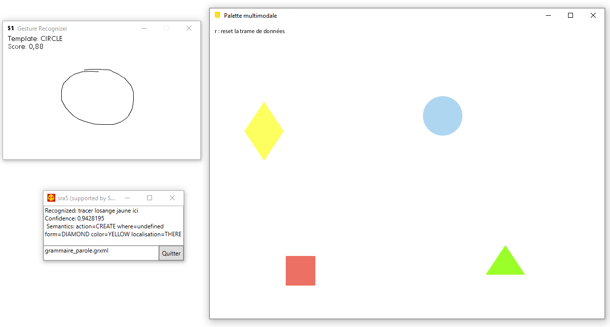

# Moteur fusion Multimodale

Projet IHM Multimodale 3A SRI 2023

Autheurs : Julian TRANI & Pauline JOBERT

## Installation de l'application

Avant d'installer l'application, quelques prérequis sont nécessaires :

-   une version de Java 17 installée sur votre machine

## Lancement de l'application

Pour lancer directement l'application avec les différents agents, il suffit d'exécuter le fichier Projet_fusion_TRANI_JOBERT.bat, en double-cliquant dessus.

Si cela ne fonctionne pas, vous pouvez lancer chaque agent manuellement :

-   **Reconnaissance de geste** : exécuter le fichier OneDollarIvy/OneDollarIvy.exe
-   **Moteur multifusion** : exécuter le fichier Palette/Palette.exe
-   **Reconnaissance vocale** : exécuter le fichier sr5/sra5_on.bat

## Utilisation de l'application

Une fois l'application lancée, vous devez avoir 3 fenêtres comme la figure ci-dessous, vous pouvez alors utiliser les différents agents pour fournir les différentes informations (action, forme, couleur, localisation)

